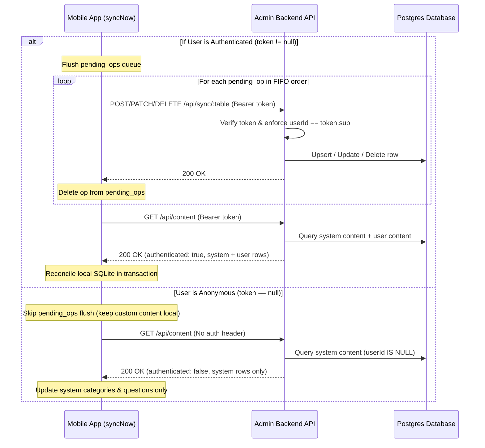

# Mobile App Sync & API Documentation

This document describes the synchronization architecture, API endpoints, authentication model, and data flows between the **QuizYourself** mobile app and the **quiz-yourself-admin** backend.

---

## 1. Overview & Architecture

QuizYourself is built as an **offline-first** application:
- **No account required**: Users can download the app and immediately take quizzes, browse categories, create custom categories/questions, and record quiz history without signing in.
- **Local SQLite storage**: All app data is stored locally in an embedded SQLite database (`quiz_yourself.db`).
- **Cloud synchronization is tiered**:
  1. **Anonymous / Free Sync**: Unauthenticated users can sync the default/seed catalog of categories and questions maintained by admins. Any custom content or quiz history they create remains private and strictly stored on their device.
  2. **Authenticated Cloud Backup & Restore**: When a user creates an account or logs in via Auth0, the app backs up their custom categories, custom questions, favorites, and quiz history to PostgreSQL, enabling cross-device synchronization and restore.

```
                      ┌──────────────────────────────────────────────┐
                      │          QuizYourself (Mobile App)           │
                      │  - Local SQLite (offline-first)              │
                      │  - pending_ops write-ahead queue             │
                      └──────┬────────────────────────────────┬──────┘
                             │                                │
      1. Anonymous Sync      │                                │ 2. Authenticated Sync
    (GET /api/content)       │                                │ (POST/PATCH/DELETE /api/sync)
    (No Auth Header)         │                                │ (GET /api/content)
                             │                                │ (Bearer <Auth0 Token>)
                             ▼                                ▼
┌──────────────────────────────────────────────────────────────────────────────────┐
│                         quiz-yourself-admin API Backend                          │
├──────────────────────────────────┬───────────────────────────────────────────────┤
│ Public / Default Catalog         │ User Data Backup & Restore                    │
│ - WHERE userId IS NULL           │ - Token verified via Auth0 JWKS               │
│ - Read-only for anonymous users  │ - WHERE userId = token.sub                    │
│                                  │ - Mutates user categories/questions/history   │
└──────────────────────────────────┴───────────────────────────────────────────────┘
                                   ▲
                                   │ 3. Admin Web Management
                                   │ (Cookie Session + Allowlist)
                      ┌────────────┴─────────────────┐
                      │    Admin Web App (Dashboard) │
                      │  - Manage System Content     │
                      │  - View & Resolve Reports    │
                      └──────────────────────────────┘
```

---

## 2. Authentication Model

The backend supports two distinct authentication methods:

### A. Mobile Client Bearer Tokens (Auth0 JWT)
- Mobile uses Auth0 PKCE (`expo-auth-session`) to obtain an access token.
- Mobile attaches this token in HTTP requests via:
  ```http
  Authorization: Bearer <accessToken>
  ```
- **Server Verification (`lib/auth-mobile.ts`)**:
  1. Verifies the JWT signature against Auth0's JWKS (`https://${AUTH0_DOMAIN}/.well-known/jwks.json`).
  2. Falls back to `https://${AUTH0_DOMAIN}/userinfo` if the token cannot be verified locally (e.g. opaque token or missing audience).
  3. Caches validated identities (`userId = token.sub`) in memory for 5 minutes with a TTL map to minimize latency and avoid rate-limiting Auth0.

### B. Admin Web Session (Cookie-based)
- The admin dashboard uses `@auth0/nextjs-auth0` cookie sessions.
- In `proxy.ts`, web routes are protected while all `/api/*` endpoints are exempted from HTML session redirects so they return clean JSON status codes (`401`, `403`).
- Admin endpoints verify the user's email against the `ALLOWED_EMAILS` environment variable.

---

## 3. API Endpoints Reference

### 3.1 Content Synchronization: `GET /api/content`

Downloads the content catalog and backed-up user state.

* **Authentication**: Optional (Bearer Token).

#### A. Anonymous Request (No `Authorization` Header)
- **Response `200 OK`**:
  ```json
  {
    "authenticated": false,
    "categories": [
      { "id": "uuid", "name": "Science", "parentId": null, "userId": null }
    ],
    "questions": [
      {
        "id": "uuid",
        "question": "What is the speed of light?",
        "options": ["300,000 km/s", "150,000 km/s"],
        "correctAnswer": "300,000 km/s",
        "difficulty": "Medium",
        "type": "multiple_choice",
        "shownCount": 0,
        "categoryId": "uuid",
        "imageUrl": null,
        "userId": null
      }
    ],
    "favorites": [],
    "reports": [],
    "quizHistory": []
  }
  ```
- **Mobile Processing**: Updates local system categories and questions (`userId IS NULL`). Leaves all local custom content, favorites, and quiz history untouched.

#### B. Authenticated Request (`Authorization: Bearer <token>`)
- **Response `200 OK`**:
  ```json
  {
    "authenticated": true,
    "categories": [
      /* All system categories (userId: null) + user's custom categories (userId: authUserId) */
    ],
    "questions": [
      /* All system questions (userId: null) + user's custom questions (userId: authUserId) */
    ],
    "favorites": [
      { "id": "uuid", "userId": "auth0|123", "categoryId": "uuid" }
    ],
    "reports": [
      { "id": "uuid", "questionId": "uuid", "userId": "auth0|123", "description": "...", "createdAt": "...", "resolved": false }
    ],
    "quizHistory": [
      {
        "id": "uuid",
        "date": "2026-10-06T20:00:00.000Z",
        "mode": "classic",
        "categoryId": "uuid",
        "difficulty": "Medium",
        "playerCount": 1,
        "scoreData": [{ "id": 1, "name": "Player 1", "score": 8 }]
      }
    ]
  }
  ```
- **Mobile Processing**: Reconciles system content AND restores/syncs user's cloud content inside a single SQLite transaction.

---

### 3.2 Mutation Upload: `POST /api/sync/[table]`

Inserts or upserts a record in the cloud database.

* **Authentication**: **Required** (`Authorization: Bearer <token>`). Returns `401 Unauthorized` if missing or invalid.
* **Supported Tables**: `Category`, `Question`, `Favorite`, `QuestionReport`, `QuizHistory`.

#### Authorization & Ownership Rules:
1. The server forces `record.userId = token.userId`. A client cannot impersonate another user.
2. If `id` already exists and belongs to another user or is system content (`userId IS NULL`), the request is rejected with `403 Forbidden`.
3. System content cannot be created or modified through this endpoint.

#### Example Request:
```http
POST /api/sync/QuizHistory
Authorization: Bearer <token>
Content-Type: application/json

{
  "id": "f47ac10b-58cc-4372-a567-0e02b2c3d479",
  "date": "2026-10-06T20:00:00.000Z",
  "mode": "classic",
  "categoryId": "cat-uuid",
  "difficulty": "Easy",
  "playerCount": 1,
  "scoreData": [{"id": 1, "name": "Player 1", "score": 10}]
}
```

#### Responses:
- `200 OK`: `{ "ok": true }`
- `401 Unauthorized`: `{ "error": "Unauthorized: authentication required for cloud sync" }`
- `403 Forbidden`: `{ "error": "Forbidden: cannot overwrite another user's or system category" }`
- `400 Bad Request`: `{ "error": "Unknown table: TableName" }`

---

### 3.3 Partial Update: `PATCH /api/sync/[table]/[id]`

Updates an existing user record.

* **Authentication**: **Required** (`Authorization: Bearer <token>`). Returns `401 Unauthorized` if missing.
* **Supported Tables**: `Category`, `Question`, `QuizHistory`.
* **Authorization**: The target row must exist and have `userId === token.userId`. Attempting to patch system content (`userId IS NULL`) or other users' rows returns `403 Forbidden`.
* **Payload**: JSON object containing fields to update (e.g. `{ "shownCount": 5 }` or `{ "name": "New Category Name" }`).

---

### 3.4 Deletion: `DELETE /api/sync/[table]/[id]`

Deletes a user-owned record from the cloud database.

* **Authentication**: **Required** (`Authorization: Bearer <token>`). Returns `401 Unauthorized` if missing.
* **Supported Tables**: `Category`, `Question`, `Favorite`, `QuizHistory`.
* **Authorization**: Executes `deleteMany({ where: { id, userId: token.userId } })`. If no matching row exists (or if it is system content), returns `404 Not Found`.

---

### 3.5 Legacy Device Migration: `POST /api/auth/migrate`

Re-attributes any legacy rows stored in Postgres under an anonymous `deviceId` to the user's permanent Auth0 ID.

* **Authentication**: Token passed in `auth0Token` body property or `Authorization: Bearer <token>`.
* **Request Body**:
  ```json
  {
    "deviceId": "device-uuid-123",
    "auth0Token": "<accessToken>"
  }
  ```
* **Response `200 OK`**:
  ```json
  {
    "ok": true,
    "migrated": {
      "categories": 0,
      "questions": 0,
      "favorites": 0,
      "reports": 0,
      "quizHistory": 0
    }
  }
  ```

---

### 3.6 Question Reports: `POST /api/reports` & Admin Triage

- `POST /api/reports`:
  - **Auth**: Optional. If Bearer token is provided, associates `userId = token.userId`, otherwise uses body `userId` or `"anonymous"`.
  - **Body**: `{ "questionId": "uuid", "description": "Typo in question", "userId": "..." }`.
  - Validates that the question exists.
- `GET /api/reports`:
  - **Auth**: **Admin only** (cookie session with `ALLOWED_EMAILS`).
  - Returns unresolved reports.
- `PATCH /api/reports/[id]`:
  - **Auth**: **Admin only** (cookie session with `ALLOWED_EMAILS`).
  - Marks report as resolved (`resolved: true`).

---

## 4. Mobile Client Sync Engine

The mobile sync engine is implemented across:
- [`QuizYourself/lib/sync.ts`](file:///Users/tcmh4/personal/quiz-yourself/QuizYourself/lib/sync.ts): Queue flushing and snapshot download.
- [`QuizYourself/lib/database.ts`](file:///Users/tcmh4/personal/quiz-yourself/QuizYourself/lib/database.ts): SQLite schema, `pending_ops` table, and transactional snapshot application.

### The Write-Ahead Queue (`pending_ops`)
Whenever a local mutation occurs on the device (e.g. `addCategory`, `updateQuestion`, `deleteQuestion`, `toggleFavorite`, `addQuizHistory`), an operation record is saved to the SQLite `pending_ops` table:

```sql
CREATE TABLE pending_ops (
  id INTEGER PRIMARY KEY AUTOINCREMENT,
  table_name TEXT NOT NULL,
  operation TEXT NOT NULL,   -- 'PUT', 'PATCH', or 'DELETE'
  row_id TEXT NOT NULL,
  payload TEXT,              -- JSON payload
  created_at INTEGER NOT NULL
);
```

### Sync Lifecycle (`syncNow()`)



### Sign-In / Account Upgrade Flow

When an anonymous user signs in for the first time:
1. Auth0 PKCE login completes and returns access & refresh tokens.
2. Tokens are stored securely in local SQLite `app_metadata`.
3. `migrateLocalUserId(deviceId, auth0UserId)` runs:
   - Updates local categories, questions, favorites, and quiz history rows to reference `auth0UserId`.
   - Rewrites any pending ops in `pending_ops` to use `auth0UserId`.
4. `enqueueAllQuizHistoryForBackup()` enqueues all prior quiz runs into `pending_ops`.
5. `POST /api/auth/migrate` is called to re-attribute any legacy server-side records.
6. `syncNow()` runs:
   - Drains `pending_ops`, uploading all custom categories, questions, and quiz history to the user's cloud account.
   - Pulls back the combined snapshot.
